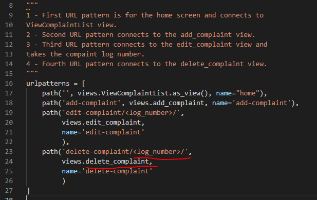

# **[Alli_cator](https://alli-cator-ms4.herokuapp.com/)**
Alli_cator is a full stack business-based web application. I built this application with my current full-time job in mind as I thought it would be beneficial for my portfolio to demonstrate that I could create a piece of software that would serve a tangible benefit in the workplace. 

My role is in the customer complaints function of a retailer and financial services company. The existing system we use to capture, manage, and keep a record of complaints isn’t user-friendly or streamlined – sometimes creating more work for the user (colleague), taking up more of their time than necessary. A problem with this system is that it doesn’t always order and filter database entries correctly, and even when it does function as it should – users still have to spend time searching through information and navigate through various screens to get the latest update on a complaint, reducing their efficiency and timeliness in responding to a customer and resolving their issue. 

To get around this, colleagues sometimes use more widely available applications such as Microsoft Excel spreadsheets to keep track of the complaints that they have allocated to them to manage. These are often unwieldly, not very user-friendly, and generally not intuitive. This also can cause consistency and quality issues due to colleagues using different systems, whereas one cohesive solution would be much better. Also, the stress caused by having to trawl through information when you have a dissatisfied customer on the phone is stressful whereas being able to see the latest update at the click of a button is very handy.

On that basis, I’ve built a full stack application to pair with the Complaints Management System that the business has already implemented which will allow users to easily create, read, update, and delete complaints with ease.

## Table of contents
* ### [Deployed Site](#deployed-website)
* ### [Demo](#site-demonstration)
* ### [UX](#user-experience)
* ### [Design](#design-features)
* ### [Features](#functional-features)
* ### [Technologies](#technologies-used)
* ### [Testing](#application-testing)
* ### [Deployment](#deploying-the-site)
* ### [Reflection](#project-reflection)
* ### [Further Development](#further-development-scope)
* ### [Credits](#project-credits)
* ### [Acknowledgement](#project-acknowledgements)
# 
# [**Deployed Website**](https://alli-cator-ms4.herokuapp.com/)  
By clicking the hyperlinked header above, you can access the final deployed site hosted on Heroku.
# <a id="site-demonstration"> **Site Demonstration**
## [Am I Responsive?](http://ami.responsivedesign.is/)
Below you can see an image of the final site in the Am I Responsive tool which shows the fantastic level of responsivity of the site to a number of viewports. A link to the tool is attached in the header above.  

# **User Experience**
In this section, I will discuss the user experience considerations I implemented during the development process.
## **Strategy**
### **Business Goals**
In terms of business scope, this application provides many benefits:
* To provide the user with an intuitive easy to use system.
* To increase colleague productivity due to the removal of un-needed time on screens.
* Increase colleague satisfaction due to the implementation of an IT solution which works for them.
* Increase in consistency across all teams when it comes to complaint allocation management. 
* Increase consistency in terms of training due to a tailored solution being available for all teams.
### **User Stories**
Below are the user stories that needed to be fulfilled for the project to be successful from the perspective of the user:
* **User Story: Register** - As a **user** I should be able to **register for an Alli_cator account** so that I can access the functionality of the application.
* **User Story: Sign In** - As a **User**, I should be able to **sign in upon accessing the application** so that **I can see the complaints I have allocated to me**.
* **User Story: Add a complaint** - As a **User, once approved and authenticated,** I should be able to **add a complaint to the database** so that **I can review it going forward**.
* **User Story: Edit a complaint** - As a **User, **once authenticated**, I should be able to **update a complaint** so that **I can change its details as it progresses**.
* **User Story: Delete a complaint** - As a **User**, once authenticated, **I should be able to delete a complaint** from the database so that **I can remove it once I have dealt with it.**
* **User Story: Sign out** - As a **User**, whilst authenticated, **I should be able to sign out of the application so that I can ensure nothing happens to my complaints when I am not using the application.**  

Following the planning stage of the project, these user stories were added to a project Kanban board on the GitHub repository so that I could adopt an agile approach and develop each piece of significant functionality at a time.
Before going any further, I think it would be beneficial for the readers of this document to understand the application that I built this one to pair with. The application that the business uses to record, close (resolve), and keep a history of complaints is called the Complaints Management System or CMS. Not to be confused with Content Management System, I will refer to the system as CMS moving forward .
When a user signs into the CMS, an unfiltered list of all database entries are presented to the user. CMS sometimes filter in date order, but it is temperamental  . 

  
To locate a complaint, the user would need to use the filter. Granted there are many fields to filter the entries on but the problem remains that the ordering of the complaints does not come in any order and the key human identifiers for the customer are not kept on the top level of the system (customer name) so you could go into one complaint when you haven’t filtered the list and it could be the wrong one.
To access more detail about the complaint, the user then must click the view button.
If they want to access the latest update, they would then have to click the notes button and scroll through a list of notes to see where it is up to. This is less than ideal when an unhappy customer is on the phone or just when a user needs to be up to speed on a complaint quickly.

# **Structure Plane**  
I started my project by thinking about my user and the business function the user needs to satisfy. The main principles behind the development of the application were:
1. Ease of use – The application is easy to use and should be intuitive so that someone with little technical ability or exposure can pick it up straight away.
2. Reduce information overload – The user should no longer need to dig through screens and notes or use cells in a spreadsheet. The information should be at the fingertips and easy to read.
3. Consistency – This application will replace the various tools used by colleagues within the business so that there is a central platform.

While a system such as this is usually designed for use on a laptop or desktop monitor, I did approach the design of the application with a mobile first attitude . I also knew that I wanted to incorporate the libraries and frameworks that I’d learnt during this part of the course.

One of the key principles behind the application was the reduction of information overload. If you look at the example spreadsheet that one of my colleagues provided to me and imagine this with 30 of the rows full of data, it would be very overwhelming. 

Whilst a system such as this is usually designed strictly for use on a laptop or desktop monitor, I did approach the design of the application with a mobile first attitude. I also knew that I wanted to incorporate the libraries and frameworks that I’d learnt during this part of the course.
One of the key principles behind the application was the reduction of information overload. If you look at the example spreadsheet below that one of my colleagues provided to me and imagine this with 30 of the rows full of data, it would be very overwhelming. 

The first thing I did was separate what data was key when it came to retrieving an update and through this process, I designed the data model for the application which is the driving force behind the application.
At the beginning of this project, I created a plan with Microsoft Powerpoint. The first part of this plan consisted of a mind map around the technologies that I might use to develop the application to which I added the main CRUD functionality with an agile approach. Please note: this was the planning stage and some of the technologies or functionality may not have been implemented in the final version.  

From here, I developed my data model. I started again with a table to decide the data structure and where this would be presented to the user. 
  
I did consider having two data models but rationalised with myself that a second data model was not required due to one of the main user considerations being a reduction of information overload . As a result, the project only has one data model and that is the Complaint model. I will touch more on this and provide a breakdown of the code later in the document. 

# **Skeleton Plane**
Now I had an idea of which technologies and functionality I would be using, I proceeded to create some basic UI sketches before doing some more detailed wireframes. Each of the wireframes are set out below.
  
### **Mobile Wireframes**

### **Tablet Wireframes**

### **Laptop & Larger Screen Wireframes**
  
Whilst the development largely stuck to these wireframes, there were some very slight deviations in terms of layout and functionality during the development process as well as some additional functionality added.

# **Design Features**
## **Colour Choices**
Below I will outline my colour choices for the project and discuss some of the main colours and the impact that this has on the user:
  

* **#759252:** This is my main application colour. The name of the application is a play on the animal ‘alligator’, so I wanted a green colour to represent that. I found the colour after searching for an alligator green colour palette on Google. I didn’t want anything too murky or dark as I felt this would not appeal visually to the user, but I wanted to have a contrasting colour to that of the page body.
* **Whitesmoke (#F5F5F5):** I chose this as the colour for the body as on bright screens, the contrast between a darker colour, in this case the green of the navigation, and the default white background colour of the body is quite jarring. It isn’t far off white, but the duller tone makes the page more visually appealing and easy to view for the user whilst maintaining the contrast which gives clear indication of the sections of the page.
* **Lightgray (#D3D3D3):** I chose this as the background colour for my forms to ensure that the colour did not distract the user from the form content.
* **#E8BD6E:** I chose this colour as one of my main action accent colours. It has a pleasant visual contrast with the main green colour I used. 
* **#eb3939:** Whilst this red did not appear on my colour palette in relation to the main application colours, I knew that I wanted any delete functionality to be visually reinforced to the user with a striking colour. As such, I used the red colour rule in CSS and then used the colour picker within dev tools to locate a shade which was both visually striking and in-keeping with the pastel colours utilised by the rest of the application. 

In terms of tools, I used when it came to colours, I used:  
* **[ColourSpace](https://mycolor.space/)** to get complimentary colours for my main green colour.
* **[Opposite colour tool](https://www.colortools.net/color_complementary.html)** which allowed me to find the opposites of the colours I selected to use within hover pseudo selectors to provide visual feedback to users of their actions.

## **Imagery**	
In terms of imagery, there was little need for any imagery due to the data focused nature of the application. I did make an exception to this and included a little alligator logo which I downloaded as a PNG from [Flaticon](https://www.flaticon.com/premium-icon/crocodile_3120796?term=alligator&page=1&position=8&page=1&position=8&related_id=3120796&origin=search). These icons are free provided that the author is attributed, so thanks very much Freepik. I did use Flaticon to change the colour of the icon to white.

## **Iconography**	
In terms of iconography for the rest of the site, I used Font Awesome’s free library which is inserted via CDN in the base template head. You can find more information on how to sign up and use the service [here](https://fontawesome.com/).  
In terms of the specific icons, they can be located in the code within the classes of all "i" elements. 

## **Fonts**	
I chose my font to pair with Bootstraps standard font, I knew I wanted some sort of Mono font, so I auditioned using Google Fonts. I eventually settled on **Roboto Mono** as my custom font which is used throughout the project for headings buttons and text for visual accents. I used three font weights which I will detail in the screenshots below.  

# **Functional Features, Code Breakdown and Explanation**
Within this section, I will firstly detail the data model, the functional features of the application and how they relate to the user stories. From there, I will provide a front and back-end code breakdown and explanation so that should you need to understand, use, or manipulate the code for this application, you can do so with ease. Where required, I will utilise screenshots to highlight the functionality of the application.

As this application is a data-driven CRUD application, I will start with the final data model and then move to the main CRUD functionality. Finally, I’ll explain the additional libraries utilised within the project.

**Please note:**  the main custom (non-library) CRUD functionality of the application is protected by authentication which will be discussed following the main CRUD breakdown. As a result, all code explained below is on the basis of successful sign up and sign in using the Django Allauth library.

## Final Data Model
As this application is data driven, everything stems from the data model. From there I will explain the views and the templates.

  

1. On line 6, I import the User model so that I can use it within my custom model.
2. On line 15, I create the Complaint class which inherits the Django models.Model class.
3. Log_number - From line 16 to line 21, I declare the log_number column. This is a CharField, it must be unique, it must not be blank and has a max_length of 10 characters.
4. Customer_surname – On line 22, I declare the customer_surname column. It’s a Charfield, it has a max length of 40 characters and cannot be blank.
5. Complaint_category – From line 23 to 26, I declare the complaint_category column. It’s a Charfield, it has a max length of 100 characters and cannot be blank.
6. Date_logged – On line 28, I declare the date_logged column. This is a DateField.
7. Case_owner – On line 29, I declare the case_owner column. This is a ForeignKey field. It takes the User table as it’s first parameter and then the on_delete parameter which is set to models.CASCADE. This means that if a User is deleted from the User table, all their entries are deleted as well.
8. Boolean fields – From line 30 to 33, I declare four Boolean fields. You can see the names of said columns and these Boolean fields form the status of the complaint. 
9. Latest_update - Finally, in terms of columns, I declare the latest_update database column. This cannot be blank and has a max length of 250 characters. This is ample to leave a short update with a few bullet points as to where a complaint is up to.

On line 41, I declare a Meta class to confirm how the entries should be ordered in the database. In this case, I want the entries ordered by date_logged. Oldest to newest. If you wanted to reverse this order and have newest to oldest, you could just add a “-“ before the column name. Once the Model was created and connected to my database on Heroku, which is explained within the deployment section of the document, I ran two commands:

* **Python3 manage.py migrate**
* **Python3 manage.py makemigrations**

These commands create the database table based on the model I just described which then allows for data to be created, submitted and manipulated.

## **Base.html - template**
My application uses templating logic so all the pages within extend from the base.html page. This page contains the head, meta, links, CDNs and scripts used to make the site function as it should. It also contains the navigation which in turn contains templating logic which renders different nav links depending on whether the user is authenticated or not. If authenticated, the user will be able to access the CRUD functionality of the application via the nav and page, otherwise, the only links available to them are those for “register” or “sign in”.
## **CRUD**
### **Read**
The first part of the functionality I developed and hence the first part I will explain is the “Read” element of the application’s CRUD functionality. 
#### **Back-end code**
Upon successful sign up and sign in, the user can successfully access the ViewComplaintList view. This view is in turn protected by the login required mixin which is imported at the top of the views.py file and inserted into the class-based view as the first parameter. This mixin prevents any unauthorised users from accessing it and instead directs them to the sign in template.
##### **ViewComplaintList View**

The view accesses the Complaint model. 
The view then overrides the default get_queryset function of the generic.ListView class.
The overridden get_queryset function returns the Complaint table but performs two actions:
1. Firstly, via the “.filter”  method, the function filters the complaint table so that the only entries that are shown are those that are equal to self.request.user (ie the user that is logged in). This way, the logged in user can only see their own entries and no other user’s entries.
2. Secondly, via the “.order_by” method, the order of the entries is determined via the date_logged column in the database table so that the rendered entries are displayed oldest to newest.  

The view then serves the index.html template which takes the data from the data base and renders it into a user-friendly accordion with each accordion item containing an entry for the database.
Finally, the paginate_by setting enables pagination when the database entries for the user exceed 10, which prevents information overload.

#### **Front-end**
You can view the HTML, CSS and custom JavaScript in the code repository but when rendered with a successful sign in where database entries exist for the user, the index page will look like this:

**1.** Here you can see the first impact of the overridden get_queryset function filtering the entries so that only the logged in user can see their own entries. This reduces the risk of deleting another user’s entries as the delete functionality can only be accessed via the expanded accordion as part of the entry itself. I took this screen shot whilst logged in as the Admin superuser and as you can see the entries filter down to the Admin superuser.

**2.** This is the second part of the overridden get_queryset function, the entries are ordered in date order. As an additional point, there is a Django template filter applied to the data being inserted into the date logged field of each entry which displays the date using the UK locale short date rather than the YYYY-MM-DD format required by the DateField in the database.

**3.** Finally, you can see the pagination has appeared as there are more than 10 entries for the user which splits them across different pages to reduce information overload and decreases scrolling time. The pagination button is only revealed when the pagination truthy falsy check is true, and it will only render if there are enough database entries and will not render if the condition within the view is not met. In this case, the condition to meet is entries greater than 10, which will render the pagination buttons.

The functionality of the ViewComplaintList view is expanded (quite litterally) through the use of the customised Bootstrap Accordion. The items within the accordion are created
by looping through the items found in the database matching the filter using a Django templating “for” loop. The primary unique reference within the database (log_number) is
inserted into the various IDs required for expanding the accordion to prevent all accordions from expanding and collapsing on the click of one item. The “for” loop iterates
through the returned data structure from the view (complaint_list) and passes it to a temporary template variable (complaint). From there, the template variables are pulled
through into their corresponding HTML data containers using template variable syntax ({{}}) and dot notation. An annotated example is provided below:

### **Accordion Data**
Depending on the screen resolution, the header data to identify the complaint is rendered in display: block with column headers beside the data (mobile and portrait tablet view) or display: grid with the column headers displayed in a container (landscape/portrait tablet view, up through laptops and larger screens).
The data within corresponds to the fields within the Complaint model and is inserted via template variables:
1. **Log number** – This is rendered for each complaint and is also inserted into the accordion IDs as they are unique. This prevents all accordions from collapsing and expanding at once, giving the user control over the information they see. It correlates to the log_number CharField on the Complaint data model.
2. **Customer surname** – This is rendered from the customer_surname column in the complaint table. It correlates to the customer_surname CharField on the Complaint data model.
3. **Date logged** – This is rendered from the date_logged column in the complaint table. It correlates to the date_logged DateField on the Complaint data model.
4. **Complaint category** – This is rendered from the complaint_category column in the complaint table. It correlates to the complaint_category CharField on the Complaint data model.
5. **Case owner** – This data is rendered from the case_owner column in the complaint table. It correlates to the case_owner ForeignKeyField on the Complaint Data Model which accesses the User data model to pull user data into the application.
6. **Welcome email, customer contacted, holding correspondence & outstanding actions** – The data in these containers is pulled from the columns of the same name in the complaint table. Within the template, a truthy/falsy conditional statement generates appropriate HTML based on the user’s input. These fields correspond to the BooleanFields on the Complaint data model.
7. **Latest update** – This data is rendered into a read-only text area in this area of the application. The data comes from the latest_update column on the complaint table and correlates to the latest_update CharField on the Complaint data model.
8. **Edit complaint** – This button is how the user accesses the “Update” functionality of this CRUD application. This will be covered later in the document.
9. **Delete complaint** – This button is how the user accesses the “Delete” functionality of the CRUD application. This will also be covered later in the document. 
To summarise, this backend and front-end functionality forms the “Read” aspect of the application. Collectively, it satisfies the below user story:

“User Story: Sign In - As a **User**, I should be able to **sign in upon accessing the application** so that **I can see the complaints I have allocated to me**.”
### **Create**
In this section, I will explain the “Create” aspect of the application’s CRUD functionality:
#### **Backend**
The create functionality is handled by the add_complaint view. Let’s step through it and explain how the data is handled.  

Firstly, the view is protected from unauthorised access by the @login_required decorator (line 60). To use this decorator, you need to import it at the top of the views file
similarly to how we used the LoginRequiredMixin in the previous view. You can import this module from the Django auth library with the following import statement: “from django
contrib.auth.decorators import login_required”. I added this during the testing phase where I accessed the URL pattern of this page without being logged in. I saw that the form
was displayed but one of the essential fields (case_owner) was missing as a result of me being unauthenticated.

The view takes the user "request" as a parameter. This is essential when writing a Django function-based view.

Just inside the view; starting on line 62, I have created a try/except block. I added this during the testing phase as I was receiving a server error when attempting to create
a record in the database where the log number in question already existed. This was throwing an integrity error as the log number CharField on the Model is meant to be unique. 
Inside the try block (line 62), the code for a successful submission is executed. Firstly, the request method is checked and if it is equal to POST (which it is in the front
end form), the form fields are parsed via their name attributes and assigned to variables with the same name. You will notice that the same naming conventions have been
followed throughout the application, the names within the Model correspond to all fields where data is collected or displayed. 

From there, the Complaint model is called via the “Complaint.objects.create” method (line 74 to 85) and within I assign the now filled variables to their corresponding columns
within the database.

To feedback to the user what has happened on a successful submission, I imported the Django messages module at the top of the file with the following import statement: “from
django.contrib import messages”. The message tags are already pre-defined as bootstrap classes in the settings.py file and there is some templating logic and HTML in the index
html page ready to catch the message. On line 86, I raise a custom success message to advise the user that the data has been submitted successfully and then via the redirect
method, the user is taken back to the home page where the message is displayed. The redirect module is imported from Django at the top of the file via the following import
method: “from django.shortcuts import render, redirect”.

The data submitted by the user should never be invalid thanks to the rigid validation criteria both client and server side. 

The only time the submission should ever be unsuccessful is due to a database integrity error caused by a log number being submitted which already exists in the database. 
To ensure that these errors are caught, I imported the IntegrityError module at the top of the file with the following import statement: “from django.db import IntegrityError”
The except block (line 92) catches the integrity error and raises an error message and then in turn redirects the user back to the home page where the error message is
displayed.

#### **Front-end**
To access the view, the user must click the add complaint button in centre screen. There’s a pseudo selector applied to this to make the button light up and give visual
feedback to the user. Let’s go through the page that’s displayed:

1. This is the field where the user enters the log_number. The field is required and has a pattern attribute which restricts submissions using a regular expression so that only digits can be accepted into the text input. It also has a maxlength of 10 characters. Guidance is provided in the small text below as to the validation requirements for the field. 
2. This is were the user enters the customer’s surname. It’s a required field and has a maxlength of 40 characters which is more than ample for the purposes of submitting a customer surname. 
3. This is where the user can enter a predefined complaint category. All the complaint categories in the business are pre-defined and have set processes to resolve them. I did play around with having a select field to populate the field but some areas have 50 to 60 complaint categories and scrolling through a list and missing the one you are looking for is really overwhelming and frustrating. As a result, I decided to leave this as a text field so that the user can be free to copy and paste, abbreviate and generally just be more flexible. It is a required field and has a max length of 100 characters.
4. This is where the user enters the date the complaint was logged. It’s a date input and when clicked allows the user to use the browsers date picker widget to select the date, month and year the complaint was registered. This plays into the ordering functionality of the application. 
5. This field is where the case owner of the case is detailed. I wanted to restrict this for regular users of the site as the business operation dictates that the executive who logs the complaint should manage it until it is resolved. As a result, I decided not to have a field where a user would be able to enter a username. What I did to lock the complaint down to the logged in user was add a “readonly” attribute and pull the value of the logged in user into the field via the value attribute. As a result, this field cannot be changed and always populates with the currently logged in user. This field is really important in terms of the read functionality of the application as without this, the user would be able to allocate complaints to other team members which would pose a risk as complaints may end up going untouched.
6. These bootstrap switches set the status breakdown of the complaint. This allows a user to quickly and efficiently select what actions have been completed on a complaint and generate useful management information both at a user and senior stakeholder level. These fields; as they are essentially checkboxes, are not required but set to true when the switch is active which then has an effect on the HTML which is rendered for the entry on the home page.
7. This field is essentially a notes field. The application is supposed to be a quick and snappy update on a complaint so whilst required, it is limited to 250 characters to prevent anyone leaving a gigantic difficult to read note. This could be increased should the need arise by simply amending the Complaint Model. 
8. This is the reset button and allows the user to quickly clear the entire form if they’ve made a mistake. I positioned it on the left to ensure that the user doesn’t accidentally reset the form when coming out of the latest update text field.
9. This is the submit button for the form. It posts the data from the form to the view which then stores it in the database or throws an integrity error and redirects the user to the home page.

To summarise, this backend and front-end functionality forms the “Create” functionality of the application. Collectively, it satisfies the following user story:

**User Story: Add a complaint** - As a **User, once approved and authenticated,** I should be able to **add a complaint to the database** so that **I can review it going forward**.
### **Update**
In this section, I will explain the “Update” aspect of the application’s CRUD functionality:
#### **Backend**
The update functionality of the application is handled by the edit_complaint view. It’s largely a duplicate of the add_complaint view. To access this functionality, the user must expand the complaint accordion entry and click the “edit complaint” button.

Firstly, when setting up the URL which will trigger this view, we need to add in a reference to the entry so that the relevant entry can be loaded into the form. I did this by casting the log_number field of the entry into the URL so that it can then be accessed by the view. See the URLs below:

Now, let's step through the view code:

Again, this view is decorated with the login_required decorator to prevent any unauthorised users from accessing the URL pattern and subsequently the edit_complaint view as it will direct unauthorised users to the sign in screen. 

This view also must take the request from the user as the first parameter. As the second parameter, I pass in the log_number from the URL so that I can use it to parse the database and locate the entry for use within the view. 

Just inside the view, I declare a variable called “complaint” and I assign it the get_object_or_404 which is a built in Django shortcut. This shortcut must be imported at the top of the file. You can see how I have imported it with the render and redirect shortcuts at the top of the file using the following import statement: “from django.shortcuts import render, redirect, get_object_or_404”.

The get_object_or_404 shortcut takes two parameters, the Model that will be searched and then the second parameter is the value you will be searching for, which in my case is the log_number of the complaint passed in through the URL and then into the view to be used in this operation. The only time that a 404 error would be thrown in this case is if the user manually typed a log number into the URL pattern following the edit-complaint/ part of the URL. The intended way to edit a complaint is to access it via the displayed entry itself on the home page.

We’re going to skip the conditional statement for a moment and move down to line 145. I create a context variable here and assign it a dictionary with one key value pair. This is an important step as without the context, I wouldn’t be able to pull the data for the entry I’ve selected into the template for editing in the form. You can see in my example that I assign the ‘complaint’ key a value of ‘complaint’, which is the variable that I declared right at the start of the function. I then pass the context into the page when it is rendered on line 148. 

Passing in the context variable means that I can now access the database columns in the fields and detail them in the form fields using template variables and dot notation. So for example, when I want to pass the customer’s surname into the form field, I use the value attribute of the field and insert {{complaint(the context).customer_surname}}. 

Now that we’ve rendered the template and passed the complaint details in with the context, let’s move back up to the conditional statement (line 129). Inside this conditional statement, the existing complaint entries data is saved over in the same method as adding a complaint. The name attributes of the form are accessed and then stored in the existing “complaint” context columns. Then, on line 142 I call the complaint.save method which saves the data in the complaint.column_name variables back to the complaint table on the database. As there is no logic to determine if the field has changed, I do a complete overwrite of the entry by passing in the “update_fields=None” argument to the save method. This forces all columns for the entry to be overwritten and as such everything is as the user leaves it.

As usual, once the data is processed, a feedback message is thrown through the view which is then caught by the index.html template once the user is redirected. 
There is no try and except block here as the only errors that could arise from this are not from the code but from bad requests or server errors, all of which are handled internally by Django. An integrity error cannot be thrown as the log_number within the template is set to read-only so cannot be changed, thus protecting the integrity of the database. 
#### **Front-end**

The edit_complaint view renders the edit_complaint.html template. As you can see from the example above, the UI is almost identical to the add_complaint.html form. Let’s step through the functionality:
1. **Complaint log number** – Instead of being a user input in this part of the application, the log number whilst set to required is readonly. The value is passed into the template via the context and is then prepopulated into the field via the value attribute using the template variable {{complaint.log_number}}. I set this as readonly to protect the value as the unique reference for the complaint and to ensure that duplicate entries for the same complaint are not created by a user accidentally changing the log number for the customer.
2. **Customer Surname** – This field is still active and can be edited by the user should they need to. I wanted the user to be able to edit this information in case the wrong customer surname has been captured. Again, the existing value for this column is passed in through the context and then prepopulated in the field via the value attribute using the template variable {{complaint.customer_surname}}.
3. **Complaint category** – This field is still active and can be edited by the user should they need to. I wanted the user to be able to edit this information as speaking from experience, it’s entirely possible that the complaint category can change over the course of a complaint. Again, the existing value for this column is passed in through the context and then prepopulated in the field via the value attribute using the template variable {{complaint.complaint_category}}.
4. **Date logged** - This field is still active and can be edited by the user should they need to. I wanted to leave this active as when complaints are logged, situations do arise where more information comes to light that the customer contacted us earlier than originally thought and as such, the date that the complaint is logged needs to be backdated. There is some additional templating logic included when the value is inserted back into the date picker. As the date field in the Model saves the date in YYYY-MM-DD format, simply pulling the date in in the format I used previously does not work, this is because the date picker auto defaults to my UK default. This caused me unimaginable amounts of pain looking for a solution. I finally found the solution in the Django template documentation [here]( https://docs.djangoproject.com/en/4.0/ref/templates/builtins/#date). To summarise, I added a date filter to the template variable to kick it back into a format that the date input would recognise. All in all, the value field for the date input was set to {{ complaint.date_logged|date:'Y-m-d' }}.
5. **Case Owner** – This works in exactly the same way as the add_complaint.html form. It pulls the username of the logged in user from the Model where it is detailed as a ForeignKeyField.
6. **Complaint Status Boolean Fields** - These fields are editable but are not required. Within the template, some conditional templating logic checks are completed to assess the truthy/falsy values of each of the four Boolean field coulmns for the entry. If the value is set to true, then a checked checkbox switch is rendered and if it is false, an unchecked switch is rendered. The user can then edit these as the status of the complaint changes and those changes will take effect on the home page when the complaint is saved.
7. **Latest Update** - Just like the other fields, the existing value for this column is prepopulated between the textarea element tags using the {{complaint.latest_update}} template variable.
8. Finally, the submit button posts the form triggering the save method on the complaint and redirects the user back to the home page.

To summarise, this backend and front-end functionality forms the “Create” aspect of the application. Collectively, it satisfies the following user story:

**User Story: Edit a complaint** - As a **User**, **once authenticated**, I should be able to **update a complaint** so that **I can change its details as it progresses**.
### **Delete**
In this section, I will explain the “Delete” aspect of the application’s CRUD functionality:
#### **Backend**
The delete functionality is handled by the delete_complaint view. It is a simplified version of the edit complaint view. Lets step through the backend code, including the URL.

The complaint log number is cast into the URL which in turn calls the delete_complaint view.

To be completely watertight when it comes to unauthorised access and manipulation of data, whilst an unauthorised user would be unable to trigger the deletion of a complaint using the UI, they could still supply a valid URL path. As a result, I’ve added the login_required decorator to the front of the class.

Again, the delete_complaint view takes the request from the user and the log_number parameter passed through the URL.

I declare a complaint variable and parse the database using the get_object_or_404 method. I pass in the Complaint Model and the log_number that came through the URL.

Then on line 168, I call the delete method on the complaint variable. I pass through a message to feedback to the user what has happened, this time with the error prefix so that the colour is different to that of a success message. Then I redirect the user back to the home page where a message is displayed and the user can then take the action they would like to take. 

#### **Front-end**
The template that is used in the delete functionality is the index.html template. In the UI, the user needs to expand the complaint entry they wish to delete and click the “delete complaint” button located next to callout 9 on the below screenshot.

I’ve implemented some defensive programming here to ensure that a user cannot accidentally click the delete button and the record is gone without checking. The defensive programming consists of a Bootstrap Modal. The delete button above triggers the Modal and the actual button to trigger the delete view is inside the Modal.

A Modal for every complaint in the list is rendered and the unique log number for each is inserted into the data-toggle and ID attributes to ensure that the delete button specific to each entry only triggers the modal that can delete that entry, this is similar to how each accordion header can only expand the accordion body for that particular entry. There is guidance contained within the Modal to the user which asks the user if they would like to delete the complaint and then inserting the log number for the entry via a template variable. By clicking on cancel, the cross button or anywhere on the window other than the Modal, the user can dismiss it.

The delete button is actually a link with some bootstrap and custom CSS applied to it. The href attribute of the link accesses the delete complaint view and feeds in the log number and as such, when clicked, the database is parsed for the row matching that log number, and the entry is duly deleted.

To summarise, this backend and front-end functionality forms the “Create” aspect of the application. Collectively, it satisfies the following user story:

**User Story: Delete a complaint** - As a **User**, once authenticated, **I should be able to delete a complaint** from the database so that **I can remove it once I have dealt with it.**

## **Additional Functionality**
### **Authentication**
There are three user stories which relate to authorisation. Authentication in terms of the functionality of the application is really important as whilst limited in scope,
there is customer data contained within the system so no unauthorised parties should be able to access it. I would also like to take this moment to note that whilst this
version of the application is deployed in Heroku, in a real-world scenario, no one in the public domain would be able to access this application due to its business focused
nature. As a result, this would be hosted internally on a secure business network. The three user stories which contain specifications requiring authentication are:

* **User Story: Register** - As a **user** I should be able to **register for an Alli_cator account** so that I **can access the functionality of the application**.
* **User Story: Sign In** - As a **User**, I should be able to **sign in upon accessing the application** so that **I can see the complaints I have allocated to me**.
* **User Story: Sign out** - As a **User**, whilst authenticated, **I should be able to sign out of the application so that I can ensure nothing happens to my complaints when I am not using the application.**

To implement authorisation functionality, I installed the Django all-auth library. I’ve detailed a full explanation of the installation and implementation procedure in the [deployment document](preperation-and-deployment.md).

To summarise, allauth installs the back-end functionality and additional templates which are used to sign in, register and sign out of the application. All of the validation and backend functionality is handled by Django. I pulled these templates from their location within the allauth directory into my custom templates directory and added my own custom CSS and bootstrap classes.

### **Admin**
Within the application, I also installed some additional admin functionality. 
#### **Summernote**
I’ve installed the Django Summernote library to use in the admin.py file. There’s a full breakdown of the installation and implementation process for this library in the [deployment document](preperation-and-deployment.md). To summarise, I imported the SummerNoteAdmin class into the admin file and then used it in my ComplaintAdmin class to set up the functionality of the Admin site.
#### **Export**
The final feature I would like to talk about is additional and is not covered in any user story. It’s something I decided to add following the development of the functionality which finalised the user stories. Following a discussion at work about the application now that all other functionality was in place, a senior stakeholder asked me if it was possible to export data from the application so that it could be shared or manipulated by those without access to the admin site. This prompted me to go searching for a solution to this problem, as any good business application should have the ability to make it’s data accessible to whomever needs it. 

As a result, I installed the Django import-export library. A full explanation on the installation and implementation of this library can be found within the [deployment document](preperation-and-deployment.md).
