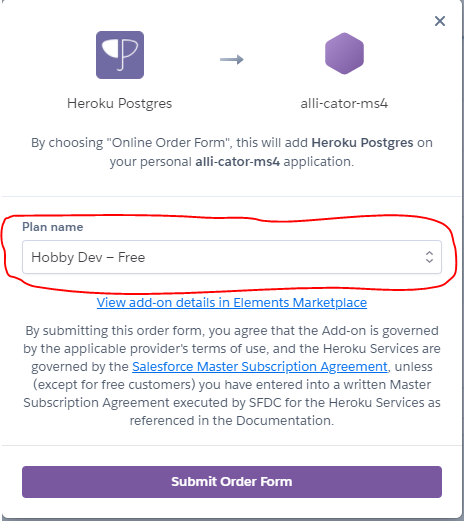
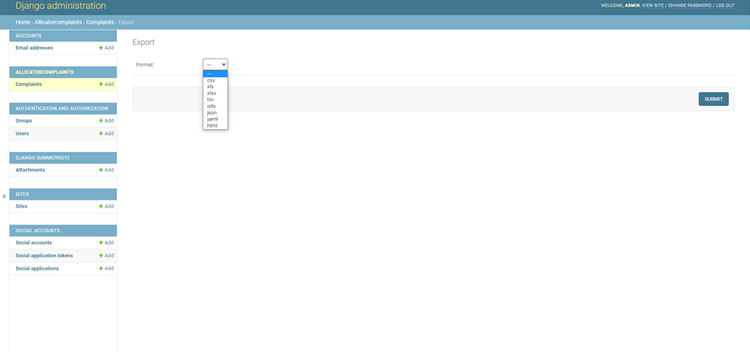

# **Alli_Cator Workspace Preparation & Deployment**
When deploying this application, I deployed very early on in the development stages to ensure that I had a solid platform to work on and to ensure that I didn’t run in to any problems towards the project submission. If you wish to use this code as a starting point for your own project, I recommend adopting the same philosophy.

Within this section I will detail the steps that I took towards the initial deployment of the application and the very important steps I took for the final deployment which must be completed when the app is moving out of the production environment and into a live space.
## Table of contents
* ### [Deployment Preparation](#preparing-workspace)
* ### [Heroku Setup](#heroku-initial-setup)
* ### [Setting Environment Variables & Settings - Workspace & Heroku](#env-workspace-and-heroku)
* ### [Setting up Cloudinary](#cloudinary-setup)
* ### [Templates Settings](#template-settings)
* ### [Setting up Allowed Hosts](#allowed-hosts)
* ### [Creating a Templates Directory](#template-directory)
* ### [Creating a Procfile](#procfile)
* ### [Deploying the initial Skeleton Project](#initial-deployment)
* ### [Installing and Implementing Django Summernote](#summernote)
* ### [Installing and Implementing Django All-Auth](#all-auth)
* ### [Installing and Implementing Django import-export](#import-export)
* ### [Collecting Static Files](#collect-static-files)
* ### [Final Deployment](#final-deployment-of-project)

# **Deployment Preparation**
To start the development and deployment process, I installed several packages into the workspace. I will list the packages, their purposes and the commands required to install them below:
1. **Django & Gunicorn** – Installed with “pip3 install django gunicorn”
    * **Django** – This is the framework I used for the project. It is a high-level python framework with lots of pre-installed and pre-coded functionality which is very useful for rapid development. You’ll find more information in the README file within the technologies section.
    * **Gunicorn** – Abbreviated from “Green Unicorn”. This is a Web Services Gateway Interface HTTP server which is commonly used to run Python web applications.
2. **Dj_database_url & psycopg2** – Installed with “pip3 install dj_database_url psycopg2”
    * **Dj_database_url** – This Django library allows us to connect to an external database which in our case will be hosted on Heroku.
    * **Psycopg2** – This package is one of the most popular database adapters for the python programming language which allows us to utilise a PostgreSQL database. It allows us to write database commands in a pythonic fashion and to a higher level of abstraction than raw SQL commands.
3. **Cloudinary** – Installed with “pip3 install dj3-cloudinary-storage”. Cloudinary is a Django package that facilitates integration with the Cloudinary static and media file
hosting service via an API. More steps are required to implement this package properly and is covered later in this section.

At this stage, all of the libraries that are required for the application to run have been installed. In terms of meeting user functionality requirements, further libraries
were installed as part of the development process which will be covered in this section. Whenever a library or package is installed, we must ensure that we have a requirements
txt file as this is the file that Heroku; our cloud hosting service, can install the relevant dependencies upon deployment.

Any time that you install an external library or package, run the following command to create/update the requirements.txt file
“pip3 freeze –local > requirements.txt”

**IMPORTANT** - If you clone my repository, you will have a copy of my requirements.txt file. To make things easier in terms of installing all of the libraries I used, please
enter the following command into the terminal "pip3 install -r requirements.txt". This will install all the dependencies in the requirements.txt file.

# **Heroku - Initial Setup**
1. Go to [Heroku](https://id.heroku.com/login) and signup for an account if you don’t already have one. If you do, sign in so that you can see the Heroku dashboard. 
5. Click the new button in the top right hand section and select “Create New App”
6. Give the application a name and select the region. When selecting a region, select the option that is closest to you. 
7. Click the “Create App” button at the bottom of the form.
8. Once the app is created, select it by clicking the application name.
## **Application Dashboard**
At this stage, I installed some add ons into the application to serve as the database. 
### **Resources Tab**
1. In the application dashboard, select the resources tab.
2. In the resources tab, in the search bar type “Heroku Postgres”. When it appears as an option in the drop down, select it.

    

3. Following the above step will open an order form. For the purposes of this project, I left the “Plan Name” field as “Hobby Dev – Free”. If you deploy this application yourself, depending on the scope of the application and its use, you may need to select something different. 

    

4. Click “Submit order form”.

    

5. You will now see that the “Heroku Postgres” add on is included in the “add-ons” section of the Heroku application. This will serve as our database whilst the application is deployed.

    

### **Settings Tab**
We have completed the necessary steps in the “Resources” tab now. Once the above has been completed, click the “Settings” tab and follow the steps below.

1. In the settings tab, click the “Reveal Config Vars” button. Contained within this section, we will detail our environment variables such as database URL, secret keys and other environment variables. These variables allow the project to function once deployed (Note: Some of the details within this section will be redacted for security purposes but I will explain the processes that need to be followed. 

    

2. Upon revealing the config vars, you will see text fields. One of the fields will already be populated with the “DATABASE_URL” variable. You must copy the value assigned to this variable as you will need to use it in your project to serve as the connection to the Heroku Postgres database add on we added in the previous section.

    

3. Once the string of text assigned to the “DATABASE_URL” variable has been copied, return to the workspace.

# **Workspace & Heroku - Environment Variables & Initial Settings**
At this point, I had already installed the relevant dependencies to get the project to work. The details of such dependencies and the commands and caveats required to install and use them are detailed elsewhere within this document. In the same directory as the manage.py file, create a new file called “env.py”. You will need to use this file to store the environment variables for the project so that it can function locally.

I used GitPod to develop this project and started with a GitPod template provided by Code Institute. As a result, the env.py file is already included in the gitignore file. If you are using another development environment, you will need to add the env.py file to your gitignore file so that your environment variables are not pushed to GitHub and on display for the world to see as they must be kept secret.

To continue preparing the project for an initial deployment, follow the steps below:
1. At the top of the “env.py” file, import the operating system library. The operating system library provides functionality which will allow the various files within the project to interact via the underlying operating system.

    

2. Using the os.environ method, set the DATABASE_URL variable locally. Please review the below screenshot for the correct syntax and assign the DATABASE_URL from Heroku to this variable as a string.

    

3. Again using the os.environ method, set a SECRET_KEY environment variable. This can be any random string of letters, numbers or characters and you can set is as whatever you like. The secret key displayed in the screenshot is for display purposes:

    

4. Go back to the settings tab in Heroku. We now need to set the SECRET_KEY variable whilst we are in the Heroku environment.

    

5. Now that we have set our first two environment variables in the workspace, we need to reference these in the “settings.py” file so that the project can function. Before we can do this, we need to complete some imports so that we can pull the environment variables in without having to hard code their values and risk pushing sensitive information to GitHub.

6. In the Django project directory (not the application directory), open the “settings.py” file.

    

7. With the “settings.py” file open, just below the “Path” import statement, import the os library. 

    

8. Below the os library import statement, import the dj_database_url library. This is one of the dependencies which must be installed into the workspace and you can find details of this package and how to install it yourself inside this document. 

    

9. At this stage, we need to write some logic into the file. This is because the env.py file will not exist in the deployed environment as we set those environment variables via the settings tab in Heroku. However, we don’t want the deployed site to throw an error if it cannot find the env.py file as this won’t be pushed to GitHub and included when we go to deploy the project. The logic you will need to write if you are following the same deployment process is as follows:

    

10. At this stage, we are done with our imports. Scroll down the settings.py file until you see the SECRET_KEY variable.

    

    Replace the now redundant SECRET_KEY value with the os.environ.get() method and pass in the ‘SECRET_KEY’ variable from the env.py file as the argument. Please refer to the screenshot:

    

11. Now that we have secured the secret key variable, we need to wire up our database. Scroll down the settings.py file until you find the databases section. You can see from the below screenshot that currently, the database is setup to run locally with the sqlite3 file.

    

    Highlight the “DATABASES” variable and its value and comment it out using CTRL + / on PC or CMD + / on a mac so that it looks like the below screenshot:

    

12. Beneath the commented out section, add a new DATABASES variable and assign it a python dictionary. Within the dictionary, there should be one key: ‘default’ and the value assigned to that key should be the dj_database_url.parse() method. Inside the parse method, pass in the os.environ.get() method and inside the .get method, pass in the “DATABASE_URL” environment variable. See the below screenshot.

    

    Now that the Heroku database URL is connected to the settings.py file via the environment variable, we are now using the Heroku Postgres database we added when we set up the app in Heroku. Because we are now using another database, we need to make database migrations. To perform the database migrations, go to the bash terminal and enter the following command:

    **python3 manage.py migrate**

    You should see the database migrations being run in the terminal.

    

    To further confirm that these database migrations have been made, go back to the Heroku application dashboard, click the resources tab and then click on the Heroku postgres link:

    

    A new tab will open that will show that rows and tables have been created because of our database migrations.

    

    At this stage, commit and push your code to GitHub ready for the next steps towards deployment.

# **Cloudinary Setup & Integration**
As static files such as CSS/JS and images will eventually become a part of the project, and as Heroku does not serve static files, we need to host our static files on a hosting service. For this project, I used Cloudinary via an API. Follow the below steps to set up a Cloudinary account and integrate Cloudinary into the workspace.
1. Visit [Cloudinary.com]( https://cloudinary.com/) and register for an account. You will need to verify your email to do this.
2. Once verified, log into your account and navigate to the dashboard. 
3. Once in the dashboard, locate the API Environment Variable and use the copy to clipboard link.

    

4. Return to the workspace and open the “env.py” file that was set up earlier in the preparation process.
5. In the env.py file, just beneath where we previously set the SECRET_KEY and DATABASE_URL variables, use the os.environ method to set the CLOUDINARY_URL to the value that was just copied out of the Cloudinary dashboard as a string (Please note: You must remove the prefix from the URL “CLOUDINARY_URL=”. Refer to the screenshot but note that the characters have been redacted for security purposes.

    

6. Now that the Cloudinary URL is included in our local environment variables, we need to return to the Heroku application and add it to the deployment environment variables as well. 

    

7. In the Heroku config vars, add the following:

    

    This will prevent the Heroku build from failing at this time because at the time of this initial deployment, we don’t have any static directories files like CSS, JavaScript or media to use at the moment and without this variable in place for the moment, we won’t be able to complete an initial deployment. We will be removing this when we complete our final deployment. Once the Cloudinary URL and DISABLE_COLLECTSTATIC environment variables have been added to Heroku, we need to add some code to the workspace. Open the settings.py file in the workspace and follow the below steps:

8. In the installed apps section of the settings.py file, add the Cloudinary libraries just above the “Django.contrib.staticfiles” list element using the following code excerpt:

    

9. Add the regular Cloudinary library just beneath the Django.contrib.staticfiles list element:

    

At this stage, we need to add some code to tell our Django application where to store our media and static files. Please follow the below steps:

1. Scroll down to the static files section of the settings.py file and add the following code to enable the use of static files:

    * Add a Static file storage variable by adding the code in the screenshot below the “STATIC_URL” variable. 

        

    * Add a Static file directory variable below the static files storage variable. Follow the screenshot below:

        

    * Add a STATIC_ROOT variable in and assign the value in the screenshot below:

        
    
2. Now that the necessary static files steps have been completed, just below the code that was added, we will now need to enter some similar code for our media files:

    * Add a media URL variable:

        

    * Add a DEFAULT_FILE_STORAGE variable and assign it the value detailed in the screenshot:

        

# **Templates Settings**    
At this stage, we have linked up our application to Cloudinary. Before we can start our first build, we need to tell the settings.py file where our templates will be stored. Scroll back up to the top of the settings.py file and just below the BASE_DIR variable, add the following code:

1. Add a templates directory using the screenshot below:

    

2. Scroll down to the TEMPLATES variable and add in the TEMPLATES_DIR variable you set just a moment ago into the ‘DIRS’ key of the dictionary:

    

# **Setting Up Allowed Hosts**    
Finally, before we can complete the initial deployment, we must add Heroku into our list of allowed hosts, if we fail to do this, the build in Heroku will fail. Scroll up to the ALLOWED_HOSTS variable inside settings.py and add the following code:

Please bear in mind that if you are deploying the app to Heroku yourself, you will need to enter whatever you called the app rather than the name of my Heroku application.

# **Creating a Template Directory**
Before I completed my first Heroku build, I added in some directories into the top level of the project so that I could store my templates, static files and media. This needs to be on the same directory level as the manage.py file as that is where Django will be looking for the directories.

# **Creating a Procfile**
The final step that we need to take before attempting a first build on Heroku is to create a Heroku Procfile. Without this file, Heroku will be unable to build and run the Django application we have created. Follow the below steps to create and write the Procfile.

1. In the top level of the project (the same level as the manage.py file), create a new file called “Procfile” (note that this file must be named with a capital p):

2. Open the newly created Procfile and input the following code

Please note that in the above code, I have referenced the name of my Django project “allicatorSystem”. When completing your own project, this code would need to change to reference the name of the Django project you set up.

At this stage, I saved all of my files, committed them and pushed them to GitHub ready for a first deployment attempt of the skeleton project.

# **First Deployment (Skeleton Project)**
## **Heroku Dashboard**
Navigate back to your application dashboard on Heroku and click the “Deploy” tab.

In the deployment method section, click GitHub. If you haven’t already connected your account, you will need to connect it before you can follow the next steps.

Once your account is connected, you can perform a search in the search bar for the GitHub repository you are using to store the code for the application. In my case, I searched for my repository
“Alli_Cator-MS4”. Once you have entered your repository name, click “Search” and provided a matching repository is found, an option will appear below providing you with the button to connect the
repository to Heroku. Click “Connect”.

Scroll down to the bottom of the page, and click “Deploy branch”

When deploying the application, it is good practice to view the build logs as this will allow you to identify any errors. You can do this by clicking the “View build logs” link. You can see from
the build logs that the Django application has now been built in Heroku, once you see this, click the “Open app” button to open the application to check for a successful install.

Provided that all the previous steps have been followed, when you open the app, you will see the same success page as when you run the application locally, only if you look at the URL bar, you can
see that the application is not running on a local server but instead on our Heroku platform.

# **Installing and implementing Summernote**
This application has a dedicated admin site. To make the administration of the data in the application more user friendly, I used the Django Summernote package.
* To download Summernote to the list of dependencies, use the following command: pip3 install django-summernote.
* I then added Summernote to the list of installed apps in settings.py above the ‘allicatorComplaints’ app.
* Then I added the Summernote URLs to the URL patterns list in the allicatorSystem urls.py file. 
    * urlpatterns = [
        path('admin/', admin.site.urls),
        path('summernote/', include('django_summernote.urls'))
    ]
* At the top of the file, I imported the include module from Django so that I can include the urls from the allicatorComplaints application in the overall project. 

In terms of implementing Summernote, we need to go to the admin.py file. Let’s step through the code:

* Firstly, the Complaint model is added to the class decorator via the @admin.register() method.
* I define an admin class (line 68), in my case it’s called ComplaintAdmin. It takes two parameters ExportMixin (I’ll cover this later) and SummernoteModelAdmin. This Summernote module is imported at the top of the file.
* Passing this into the class allows the class to inherit all the methods of Summernote. Let’s look at them quickly.
* List_filter – This variable is assigned a tuple with the fields on the model that can be used to filter the data in the admin site.
* List_display – This is the data that is available in the data table in the admin site.
* Search_fields – This provides a search bar inside the admin site, which allows an admin to search for an entry via fields from the model.

# **Installing and implementing Django all auth**
1. Firstly, to download all auth, type the following command into the terminal: “pip3 install Django-allauth”.
2. Once the package has downloaded, it must be added to the requirements.txt file so that on final deployment, Heroku can install the package as well.  
3. From here, the URLs for the relevant all-auth templates and functionality must be added to the main urls.py file. In my case, the main urls.py file is in the top-level project directory named “allicatorSystem”. Review the code screenshot below for an example.

4. Once the all auth URLs have been included, open the settings.py file. Inside the file, the allauth functionality must be added to the “INSTALLED_APPS” list. I have detailed the lines that must be added in the screenshot below.

5. Once the previous elements have been added into the “INSTALLED APPS” list, just beneath the “INSTALLED_APPS” variable, add a SITE_ID variable and set it to “1”:

6. Once the SITE_ID variable is set, just beneath it, you will need to add two variables. One is for redirecting the user when they sign in and one for when they sign out. In our case, we want to redirect the user to the home page of the application once they have signed in or out so we will set the valuable of these variables to the root directory. The two variables to set and their values are as follows:

    * LOGIN_REDIRECT_URL = '/'
    * LOGOUT_REDIRECT_URL = '/'

7. Following this, all files must be saved and database migrations need to be ran as we have included new applications which will connect up to our “Users” model. To run the migrations use the run python3 manage.py migrate command.

We don’t need to actually make the migrations as we haven’t made any changes to our data models. 

8. To check if the allauth functionality is now working, start the project and append “/accounts/login, logout or signup” to the URL to check that the correct templates are being rendered. You will notice that the templates that are being rendered are not in keeping with the rest of the UI and styling conventions. To amend the authentication templates being served, follow the below steps:

    * Firstly, check which version of Python you are using. This needs to be confirmed as it will affect the command you will enter to pull the templates into the templates directory. To obtain this information type “ls ../.pip-modules/lib” into the terminal. Note from the screenshot below, at the time of writing and application development, on my machine, I was using V3.8 of python.

        

    * From here, we need to copy the accounts templates from the all-auth library directory which is stored in the bowels of the application into our templates directory so that we can access and style them. To do this type the following command into the terminal “cp -r /workspace/.pip-modules/lib/python3.8/site-packages/allauth/templates/* ./templates”.
    * You will now see that the various required templates have been copied in their directories from their original location in the site packages, into the templates directory:

        

    * As you can see, there are multiple directories here. The templates we need to focus on concerning sign in, sign out and sign up. These templates are kept in the “account” directory. Open the account directory and locate the template and you will see that it is a standard Django template that you can effect as if it was a custom template created by you. 
    * One caveat to add when completing customisation of these allauth templates is to remove the “account/” prefix in the extension templating statement at the top of the file so that the templates extend from the custom base.html template.

# **Installing and implementing Django import-export**
One of the features I added following the planning stage was functionality to export the data from the Complaint table whilst in the admin site. To implement this feature, I installed the import-export Django library. You can find the documentation for the library [here](https://django-import-export.readthedocs.io/en/latest/getting_started.html). To import the library, use the following command:

* pip3 install django-import-export

Once installed, ensure you run the “pip3 freeze –local > requirements.txt” command to add the library to the list of dependencies so that it’s included in the final deployment.
This library is implemented within the admin.py file of the application. There are a few imports required at the top of the admin.py file to implement the same functionality as me:

1. I’m importing the ExportMixin that is passed in as a parameter to the ComplaintAdmin class.
2. I’m importing the fields and resources modules to use in the ComplaintExportResource class which controls the behaviour of the export functionality.
3. I’m importing the ForeignKeyWidget from the import-export library, this is used within the ComplaintExportResource class to replace the user ID with the users username.
4. I’m importing the User model so that I can use it in the ForeignKeyWidget.
5. I’m importing the Complaint model to use in the ComplaintExportResource resource class.

Let’s take a look at the code:

* Firstly, on line 28, the model the resource class is going to affect is defined, in my case, it’s the complaint model.
* Secondly, from line 29 to 39, we define the fields that will be exported from the application. This way if there is data you want to prevent from being exported, you can.
* On line 42, I use the exclude variable to exclude the database ID column from the export, this can again be used to prevent columns from being exported.
* From line 46 to 55, because the ID is now excluded, the order of the columns was affected. This tuple defines the strict order in which the columns from the database should be displayed. 
* Finally, from line 60, I change the case_owner field within the resource class from the users user id (integer – not very useful for reporting purposes) to the users username by using the ForeignKeyWidget.
 
Finally, in the admin class itself:

* Where we define the admin class, pass in the ExportMixin we imported as the first parameter. It must be the first parameter or it won’t work.
* Finally, at the bottom of the class, declare a resource_class variable and assign it an instance of the resource class you created, in my case ComplaintExportResource.
 
Now when I enter my site and navigate to the complaints model, you can see I have export functionality at the top.

By clicking this button, I can then use a dropdown to select which format I would like to download my data in.

# **Collecting Static Files Prior to Deployment**
Before I detail the steps I took to get my now developed application up and running, I will explain how to get the static files (images, media, JavaScript & CSS) from the workspace and onto Cloudinary.

When I completed the initial deployment, there were no static files in the workspace. 

Now at the end of the development process, I need my styles to be uploaded to Cloundinary so that they can then be served on Heroku. To do this:
1. I ensured that all my static files were saved.
2. I ran “python3 manage.py collectstatic” in the terminal
3. You will then be asked to type yes or no to overwrite all versions of the static files for the project.
4. Type yes to agree.
5. Django will collect the static files and store them on Cloudinary for use in the deployed project.

**Please note:** Any changes made post deployment to the static files will require another static file collection as above and a redeployment of the GitHub branch in Heroku.

# **Final Deployment**
I deployed this a skeleton application early in the development process to ensure that I wouldn’t run into any errors last minute. I would strongly recommend that you do the same if you use this project.

One of the main considerations when it comes to final deployment are the data models. Before putting the application into an environment where users will depend on the application, the data models must be final as any changes to this moving forward will cause problems for existing database entries. 

Below, I will detail the steps that must be taken in order to complete a final deployment of this application. 

1. **IMPORTANT** - Before attempting any sort of final deployment, YOU MUST set the debug flag in the settings.py file to false. Not doing so would leave potentially sensitive data on your application on view on the debug screens. It also prevents Heroku from accessing the static files on Cloudinary.

    

2. Just below the debug setting, add a new variable called X_FRAME_OPTIONS and set its value to ‘SAMEORIGIN’. Without this setting, the Summernote functionality for the Admin site would not work. The application will also be far less secure.

    

3. Navigate to the application dashboard in Heroku. In the settings tab, click reveal config vars. In the config vars, delete the DISABLE_COLLECTSTATIC variable that was set during the initial deployment of the project by clicking the cross button. Without doing this, the deployed project would not be able to render any static files such as CSS or JS. 

    

4. Navigate to the deploy tab as we did in the initial deployment, scroll down to the end and click deploy branch. View the build log as the application is built to ensure that everything is in its place. 

5. Once the build has completed, click the open app button on Heroku and check the application to ensure that it is working correctly.

Provided that you have followed all the steps within this document, the application should be deployed successfully.