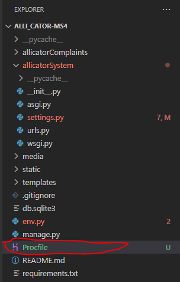

# **Alli_Cator Workspace Preparation & Deployment**
When deploying this application, I deployed very early on in the development stages to ensure that I had a solid platform to work on and to ensure that I didn’t run in to any problems towards the project submission. If you wish to use this code as a starting point for your own project, I recommend adopting the same philosophy.

Within this section I will detail the steps that I took towards the initial deployment of the application and the very important steps I took for the final deployment which must be completed when the app is moving out of the production environment and into a live space.
# **Deployment Preparation**
To start the development and deployment process, I installed several packages into the workspace. I will list the packages, their purposes and the commands required to install them below:
1. **Django & Gunicorn** – Installed with “pip3 install django gunicorn”
    * **Django** – This is the framework I used for the project. It is a high-level python framework with lots of pre-installed and pre-coded functionality which is very useful for rapid development. You’ll find more information in the README file within the technologies section.
    * **Gunicorn** – Abbreviated from “Green Unicorn”. This is a Web Services Gateway Interface HTTP server which is commonly used to run Python web applications.
2. **Dj_database_url & psycopg2** – Installed with “pip3 install dj_database_url psycopg2”
    * **Dj_database_url** – This Django library allows us to connect to an external database which in our case will be hosted on Heroku.
    * **Psycopg2** – This package is one of the most popular database adapters for the python programming language which allows us to utilise a PostgreSQL database. It allows us to write database commands in a pythonic fashion and to a higher level of abstraction than raw SQL commands.
3. **Cloudinary** – Installed with “pip3 install dj3-cloudinary-storage”. Cloudinary is a Django package that facilitates integration with the Cloudinary static and media file
hosting service via an API. More steps are required to implement this package properly and is covered later in this section.

At this stage, all of the libraries that are required for the application to run have been installed. In terms of meeting user functionality requirements, further libraries
were installed as part of the development process which will be covered in this section. Whenever a library or package is installed, we must ensure that we have a requirements
txt file as this is the file that Heroku; our cloud hosting service, can install the relevant dependencies upon deployment.

Any time that you install an external library or package, run the following command to create/update the requirements.txt file
“pip3 freeze –local > requirements.txt”

**IMPORTANT** - If you clone my repository, you will have a copy of my requirements.txt file. To make things easier in terms of installing all of the libraries I used, please
enter the following command into the terminal "pip3 install -r requirements.txt". This will install all the dependencies in the requirements.txt file.

# **Heroku - Initial Setup**
1. Go to [Heroku](https://id.heroku.com/login) and signup for an account if you don’t already have one. If you do, sign in so that you can see the Heroku dashboard. 
5. Click the new button in the top right hand section and select “Create New App”
6. Give the application a name and select the region. When selecting a region, select the option that is closest to you. 
7. Click the “Create App” button at the bottom of the form.
8. Once the app is created, select it by clicking the application name.
## **Application Dashboard**
At this stage, I installed some add ons into the application to serve as the database. 
### **Resources Tab**
1. In the application dashboard, select the resources tab.
2. In the resources tab, in the search bar type “Heroku Postgres”. When it appears as an option in the drop down, select it.

    

3. Following the above step will open an order form. For the purposes of this project, I left the “Plan Name” field as “Hobby Dev – Free”. If you deploy this application yourself, depending on the scope of the application and its use, you may need to select something different. 

    

4. Click “Submit order form”.

    

5. You will now see that the “Heroku Postgres” add on is included in the “add-ons” section of the Heroku application. This will serve as our database whilst the application is deployed.

    

### **Settings Tab**
We have completed the necessary steps in the “Resources” tab now. Once the above has been completed, click the “Settings” tab and follow the steps below.

1. In the settings tab, click the “Reveal Config Vars” button. Contained within this section, we will detail our environment variables such as database URL, secret keys and other environment variables. These variables allow the project to function once deployed (Note: Some of the details within this section will be redacted for security purposes but I will explain the processes that need to be followed. 

    

2. Upon revealing the config vars, you will see text fields. One of the fields will already be populated with the “DATABASE_URL” variable. You must copy the value assigned to this variable as you will need to use it in your project to serve as the connection to the Heroku Postgres database add on we added in the previous section.

    

3. Once the string of text assigned to the “DATABASE_URL” variable has been copied, return to the workspace.

# **Workspace & Heroku - Environment Variables & Initial Settings**
At this point, I had already installed the relevant dependencies to get the project to work. The details of such dependencies and the commands and caveats required to install and use them are detailed elsewhere within this document. In the same directory as the manage.py file, create a new file called “env.py”. You will need to use this file to store the environment variables for the project so that it can function locally.

I used GitPod to develop this project and started with a GitPod template provided by Code Institute. As a result, the env.py file is already included in the gitignore file. If you are using another development environment, you will need to add the env.py file to your gitignore file so that your environment variables are not pushed to GitHub and on display for the world to see as they must be kept secret.

To continue preparing the project for an initial deployment, follow the steps below:
1. At the top of the “env.py” file, import the operating system library. The operating system library provides functionality which will allow the various files within the project to interact via the underlying operating system.

    

2. Using the os.environ method, set the DATABASE_URL variable locally. Please review the below screenshot for the correct syntax and assign the DATABASE_URL from Heroku to this variable as a string.

    

3. Again using the os.environ method, set a SECRET_KEY environment variable. This can be any random string of letters, numbers or characters and you can set is as whatever you like. The secret key displayed in the screenshot is for display purposes:

    

4. Go back to the settings tab in Heroku. We now need to set the SECRET_KEY variable whilst we are in the Heroku environment.

    

5. Now that we have set our first two environment variables in the workspace, we need to reference these in the “settings.py” file so that the project can function. Before we can do this, we need to complete some imports so that we can pull the environment variables in without having to hard code their values and risk pushing sensitive information to GitHub.

6. In the Django project directory (not the application directory), open the “settings.py” file.

    

7. With the “settings.py” file open, just below the “Path” import statement, import the os library. 

    

8. Below the os library import statement, import the dj_database_url library. This is one of the dependencies which must be installed into the workspace and you can find details of this package and how to install it yourself inside this document. 

    

9. At this stage, we need to write some logic into the file. This is because the env.py file will not exist in the deployed environment as we set those environment variables via the settings tab in Heroku. However, we don’t want the deployed site to throw an error if it cannot find the env.py file as this won’t be pushed to GitHub and included when we go to deploy the project. The logic you will need to write if you are following the same deployment process is as follows:

    

10. At this stage, we are done with our imports. Scroll down the settings.py file until you see the SECRET_KEY variable.

    

    Replace the now redundant SECRET_KEY value with the os.environ.get() method and pass in the ‘SECRET_KEY’ variable from the env.py file as the argument. Please refer to the screenshot:

    

11. Now that we have secured the secret key variable, we need to wire up our database. Scroll down the settings.py file until you find the databases section. You can see from the below screenshot that currently, the database is setup to run locally with the sqlite3 file.

    

    Highlight the “DATABASES” variable and its value and comment it out using CTRL + / on PC or CMD + / on a mac so that it looks like the below screenshot:

    

12. Beneath the commented out section, add a new DATABASES variable and assign it a python dictionary. Within the dictionary, there should be one key: ‘default’ and the value assigned to that key should be the dj_database_url.parse() method. Inside the parse method, pass in the os.environ.get() method and inside the .get method, pass in the “DATABASE_URL” environment variable. See the below screenshot.

    

    Now that the Heroku database URL is connected to the settings.py file via the environment variable, we are now using the Heroku Postgres database we added when we set up the app in Heroku. Because we are now using another database, we need to make database migrations. To perform the database migrations, go to the bash terminal and enter the following command:

    **python3 manage.py migrate**

    You should see the database migrations being run in the terminal.

    

    To further confirm that these database migrations have been made, go back to the Heroku application dashboard, click the resources tab and then click on the Heroku postgres link:

    

    A new tab will open that will show that rows and tables have been created because of our database migrations.

    

    At this stage, commit and push your code to GitHub ready for the next steps towards deployment.

# **Cloudinary Setup & Integration**
As static files such as CSS/JS and images will eventually become a part of the project, and as Heroku does not serve static files, we need to host our static files on a hosting service. For this project, I used Cloudinary via an API. Follow the below steps to set up a Cloudinary account and integrate Cloudinary into the workspace.
1. Visit [Cloudinary.com]( https://cloudinary.com/) and register for an account. You will need to verify your email to do this.
2. Once verified, log into your account and navigate to the dashboard. 
3. Once in the dashboard, locate the API Environment Variable and use the copy to clipboard link.

    

4. Return to the workspace and open the “env.py” file that was set up earlier in the preparation process.
5. In the env.py file, just beneath where we previously set the SECRET_KEY and DATABASE_URL variables, use the os.environ method to set the CLOUDINARY_URL to the value that was just copied out of the Cloudinary dashboard as a string (Please note: You must remove the prefix from the URL “CLOUDINARY_URL=”. Refer to the screenshot but note that the characters have been redacted for security purposes.

    

6. Now that the Cloudinary URL is included in our local environment variables, we need to return to the Heroku application and add it to the deployment environment variables as well. 

    

7. In the Heroku config vars, add the following:

    

    This will prevent the Heroku build from failing at this time because at the time of this initial deployment, we don’t have any static directories files like CSS, JavaScript or media to use at the moment and without this variable in place for the moment, we won’t be able to complete an initial deployment. We will be removing this when we complete our final deployment. Once the Cloudinary URL and DISABLE_COLLECTSTATIC environment variables have been added to Heroku, we need to add some code to the workspace. Open the settings.py file in the workspace and follow the below steps:

8. In the installed apps section of the settings.py file, add the Cloudinary libraries just above the “Django.contrib.staticfiles” list element using the following code excerpt:

    

9. Add the regular Cloudinary library just beneath the Django.contrib.staticfiles list element:

    

At this stage, we need to add some code to tell our Django application where to store our media and static files. Please follow the below steps:

1. Scroll down to the static files section of the settings.py file and add the following code to enable the use of static files:

    * Add a Static file storage variable by adding the code in the screenshot below the “STATIC_URL” variable. 

        

    * Add a Static file directory variable below the static files storage variable. Follow the screenshot below:

        

    * Add a STATIC_ROOT variable in and assign the value in the screenshot below:

        
    
2. Now that the necessary static files steps have been completed, just below the code that was added, we will now need to enter some similar code for our media files:

    * Add a media URL variable:

        

    * Add a DEFAULT_FILE_STORAGE variable and assign it the value detailed in the screenshot:

        

# **Templates Settings**    
At this stage, we have linked up our application to Cloudinary. Before we can start our first build, we need to tell the settings.py file where our templates will be stored. Scroll back up to the top of the settings.py file and just below the BASE_DIR variable, add the following code:

1. Add a templates directory using the screenshot below:

    

2. Scroll down to the TEMPLATES variable and add in the TEMPLATES_DIR variable you set just a moment ago into the ‘DIRS’ key of the dictionary:

    

# **Setting Up Allowed Hosts**    
Finally, before we can complete the initial deployment, we must add Heroku into our list of allowed hosts, if we fail to do this, the build in Heroku will fail. Scroll up to the ALLOWED_HOSTS variable inside settings.py and add the following code:

Please bear in mind that if you are deploying the app to Heroku yourself, you will need to enter whatever you called the app rather than the name of my Heroku application.

# **Creating a Template Directory**
Before I completed my first Heroku build, I added in some directories into the top level of the project so that I could store my templates, static files and media. This needs to be on the same directory level as the manage.py file as that is where Django will be looking for the directories.

# **Creating a Procfile**
The final step that we need to take before attempting a first build on Heroku is to create a Heroku Procfile. Without this file, Heroku will be unable to build and run the Django application we have created. Follow the below steps to create and write the Procfile.

1. In the top level of the project (the same level as the manage.py file), create a new file called “Procfile” (note that this file must be named with a capital p):

2. Open the newly created Procfile and input the following code

Please note that in the above code, I have referenced the name of my Django project “allicatorSystem”. When completing your own project, this code would need to change to reference the name of the Django project you set up.

At this stage, I saved all of my files, committed them and pushed them to GitHub ready for a first deployment attempt of the skeleton project.