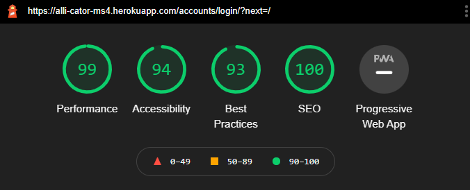
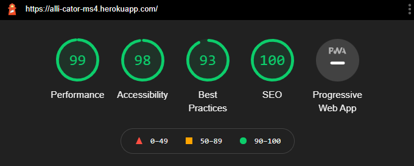
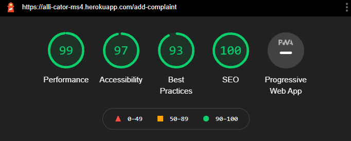
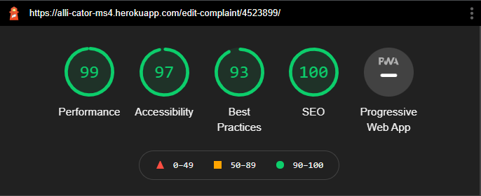

# **Alli_cator Application Testing Document**
## **Testing approach**
As I was done with development reasonably quickly, I wanted to try where possible to adopt a hybrid approach to testing and do some automated testing and then resort to manual testing where I didn’t feel confident enough to write automated testing. As a result, I think that my application is pretty watertight from bugs.
## **Issues During the Development Process**
In all honesty, I didn’t come across too many issues in the development process. Usually my code bugged out because of me leaving syntax incomplete or silly mistakes. Let me go through the main issues I encountered:

1. **Validation issues** – As I used Bootstraps HTML and customised it to suit my needs, straight after I finished the development, I validated my HTML. It was littered with errors at first where I hadn’t conformed to the w3 standards. The most pressing validation errors were due to divs inside button elements and duplicate IDs. All of which were resolved. 
2. **Date picker** – Sweet lord, the pain this caused me. During the development of the edit user story, I was able to pull all of the data about the complaint back into the form apart from the date the complaint was logged. It took some time with tutor support but we finally came to the solution of using the Django templating date filter.
3. **Complaint Data Containers** - I experienced a pretty significant visual bug in that bootstraps flex containers were making my layout look like a badly put together jigsaw due to different amounts of data bing contained within divs. To solve this, I tried I few things. I tried putting the data in a HTML table, this didn't work. I tried using Boostrap's grid system, that also didn't work. I won't lie, I was pretty close to giving up and just starting from scratch on my back up project when it hit me, like a Christamas miracle. I used CSS Grid as the parent container for my data containers. That way, I could get them positioned directly beneath the column headers (also spaced with grid). Worked an absolute treat.
## **Automated Testing**
When I wrote all my automated tests, they passed first time which was excellent. I did use a hybrid approach to testing however my confidence in using TestCases is lacking so it does have limited coverage, but my extensive manual testing makes up for this.

I decided to write test cases for my views.py file as in my own opinion, this part of the MVT framework is where the data is handled, and templates are rendered so I thought this would be the keystone place to run some automated tests. 

You can find all of my automated tests within the [test_views.py](allicatorComplaints/test_views.py) file in the allicatorComplaints directory.
## **Manual Testing**
Like I mentioned a moment ago, I have done some very extensive manual testing on my application on several devices. To do so, I created a checklist using Excel. You can access the completed checklist [here](readme-files/files/allicator-manual-testing-checklist.xlsx). Just note you will need to download it to view it.

The spreadsheet essentially goes over each element of the application, it contains the test conditions that I performed for each element. I wanted to push the code to try and get it to break or to really mess up my layout. 

I broke my testing structure into four parts:

1. **Variable testing conditions:** the things I did with the application or data that I tried to input.
2. **Display:** How the application displayed itself to me.
3. **Functionality:** Comments on the functionality.
4. **Comments:** General comments about the element.

I’m glad to say that I was largely unsuccessful in breaking the application, however, there were some small issues that have now been fixed.
## **Bugs Found During the Testing Process & Fixes**
I made a few silly mistakes in terms of the form validations in leaving required attributes out which I corrected swiftly before I really started pushing the application so I’m not going to mention those in detail. I tested the application starting on a mobile phone and moving up through the viewport sizes so I will explain the bugs in the same order as I found and fixed them. 
### **Google Pixel 3**
1.	**Accordion Header Sticky Pseudo Selector** - I found that on touch devices, the pseudo selector for hovering over a header was sticking. This is because on touch devices there is an invisible cursor that stays in place until you touch somewhere else. To fix this, as it was slightly misleading to the user, I added a corrective media query in so that the hover colour behaviour was only showing on screen widths of 1280px which is generally where laptops begin their screen resolutions.
2.	**Server Error on Duplicate Entry** - In one of my tests, I tried to add a complaint with a duplicate log number to the database. This threw an integrity error. On that basis, I added a try and except statement to my add_complaint view to catch the integrity error. If the user attempts to submit a duplicate complaint, they are now redirected back to the home page and a custom message is displayed as feedback.
3.	**Account Sign Up Redirect** - Before fixing this bug, when signing up, the user would receive a server error. This was because I was missing something in the settings.py file. I had a look at the all-auth documentation and saw that I needed the ACCOUNT_SIGNUP_REDIRECT setting adding. I set this up to direct the user to login page on signing up which in turn signs them in automatically.
4.	**Unauthenticated Users can Access Views** - I encountered an issue whereby unauthorised users could access the add & edit complaint views by entering the URL pattern. As a result, I imported the login_required function decorator and decorated each function based class to ensure that no unauthorised manipulation or creation of data could take place.
### **iPad 6th Gen**
1.	**Complaint Info Header Spans** - I had an issue where the Bootstrap breakpoints and display classes were working on mobile but there was a 1px overlap where the styles would not apply. This unluckily meant that for my iPad, the headers were displaying none, when they should have been displaying block. I added a corrective media query to the css file to push the display none up by one pixel to ensure that on any devices 768px in width, inclusive and below would be able to see the layout intended.
2.	**Safari Number Recognition** - Oh safari, the bane of all our lives. Safari was recognising the log number throughout the application as a telephone number and subsequently displaying it as a link. This is not the expected behaviour. I actually looked back at one of my own projects where I had this issue and included a zero width joiner right before the template variable. This fixed the issue.

I came across a little problem when doing my performance testing in that the image quality on the logo was causing a less than desirable score on google lighthouse. I replaced the image with a higher resolution and added a height declaration to the image to resize it. This bumped the lighthouse score up so that all pages are sitting in the mid to high 90s for all metrics.

To summarise the manual testing, the website has been tested by myself in both portrait and landscape mode (where appliable) on the following devices, browsers & operating systems:

   * Google Pixel 3 – Google Chrome, MS Edge, Firefox – Android 12
   * iPad 6th Gen - Safari 14, Google Chrome, Firefox Daylight, MS Edge - iOS 14.4
   * HP Elitebook – Google Chrome, Firefox, MS Edge & Windows 10
   * AOC Desktop Monitor – Google Chrome, Firefox, MS Edge – Windows 10.  

On that basis, the application is responsive and functional across a multitude of browsers and devices.
## Known Issues
I have a few known issues/errors that I haven’t been able to shake. 
1. In the workspace, I have some linter errors. I keep getting Complaint has no objects member. This is not a valid error. I’ve tried to # noqa these so that they don’t appear, but the code is fully PEP8 compliant. I confirmed this with tutor support.
2. I have some intermittent console errors coming from my JavaScript file. The functionality is working as expected and the console errors don’t always appear, so I am attributing this as an edge case at the moment. 
3. I have some PEP8 validation issues within the settings.py file, this file comes directly from the Django framework and no PEP8 issues are being caused by the code I’ve added so I’m leaving them alone for fear of angering the framework.
4. I have a few very small visual bugs in sticky pseudo classes when the user presses an accordion header. They are really quite sparse, mainly when customers use touch devices and the pseudo selector on hover sticks when the user presses the back button on the browser. These are edge cases also.
# Performance Testing
To test the performance of the website, I used Google Lighthouse inside Chrome Dev Tools. Below I will outline the applications performance via the metrics provided by Google Lighthouse:
## **Sign in page**

## **Home Page**

## **Add complaint page**

## **Edit complaint page**

# **Code Validation**
All my code has been validated through official sources.
## **Python** 
All my custom python files have been validated through the [PEP8 online validator](http://pep8online.com/) with no errors or issues (the settings.py file has some line length errors but the strings where these errors occur are part of the framework).
## **HTML5**
All of my templates, once rendered in Heroku, have been validated through the [W3 Markup Validator](https://validator.w3.org/#validate-by-input) via direct input. No errors or warning on any of the pages.
## **CSS3**
My custom CSS file has been validated using the [W3 Jigsaw Validator](https://jigsaw.w3.org/css-validator/#validate_by_input) via direct input. No errors or warnings present. 
## **JavaScript**
My custom JavaScript code has been validated through [JSHint](https://jshint.com/). No errors present.

